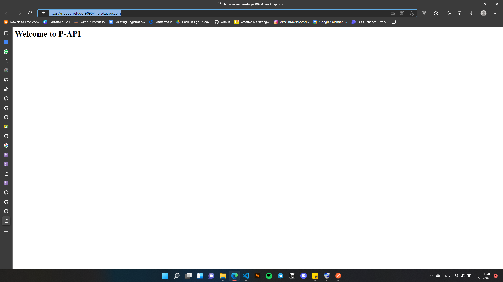
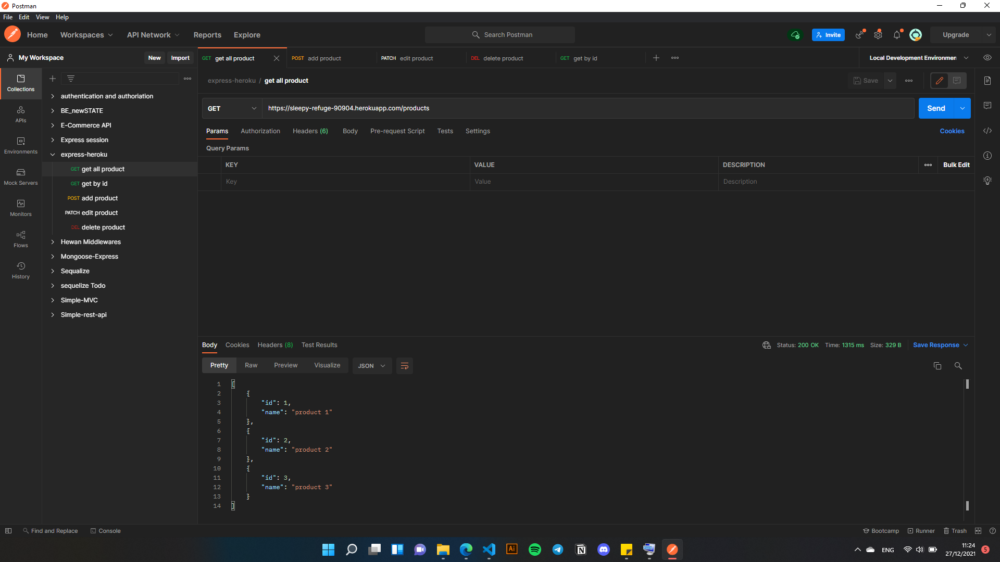
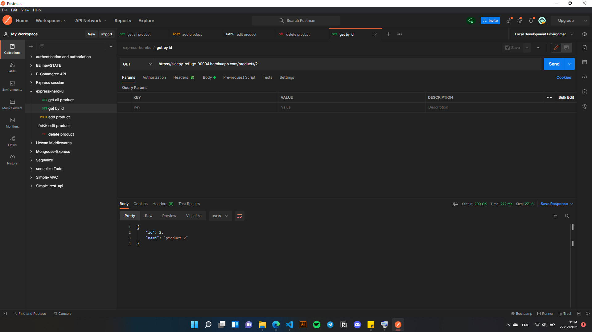
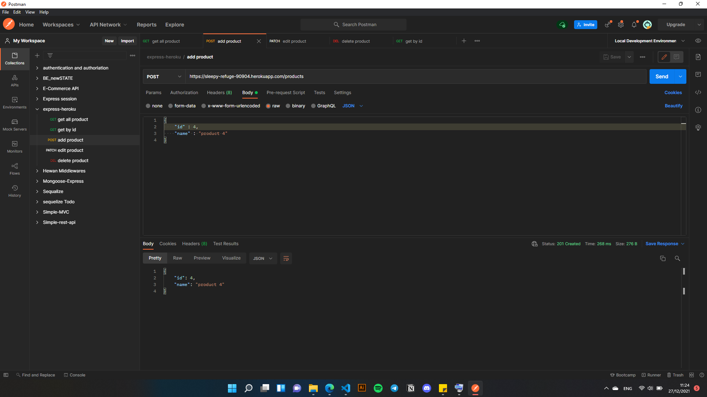
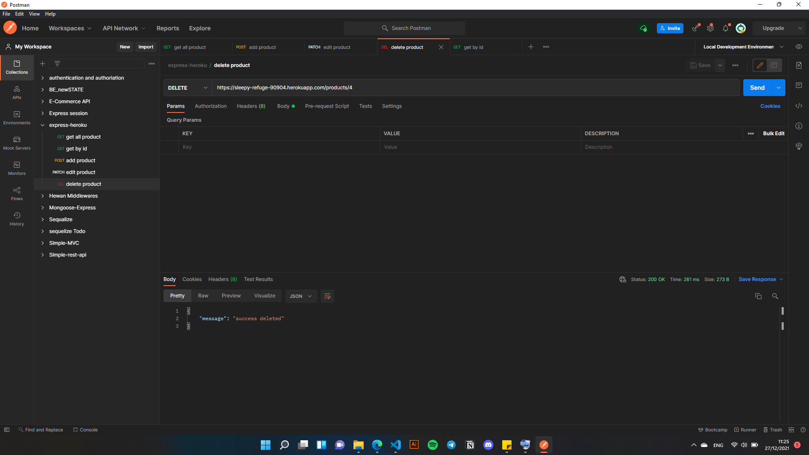

  1. Welcome
  https://sleepy-refuge-90904.herokuapp.com
  - 
  2. Get All Products
    https://sleepy-refuge-90904.herokuapp.com/products
  - 
  3. Get by id
    https://sleepy-refuge-90904.herokuapp.com/products/:id
  - 
  4. Post
    https://sleepy-refuge-90904.herokuapp.com/products
  - 
  5. Edit by id
    https://sleepy-refuge-90904.herokuapp.com/products/:id
    request body
    {
    "id" : 2,
    "name" : "product 2 dua"
    }
  - 
  6. Delete by id
    https://sleepy-refuge-90904.herokuapp.com/products/:id
  - 